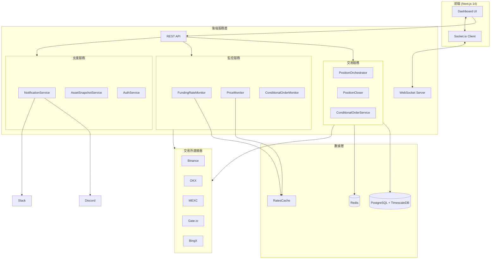
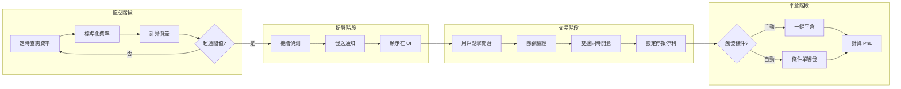
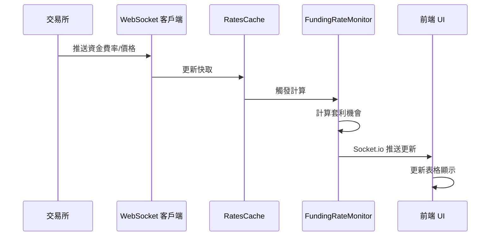
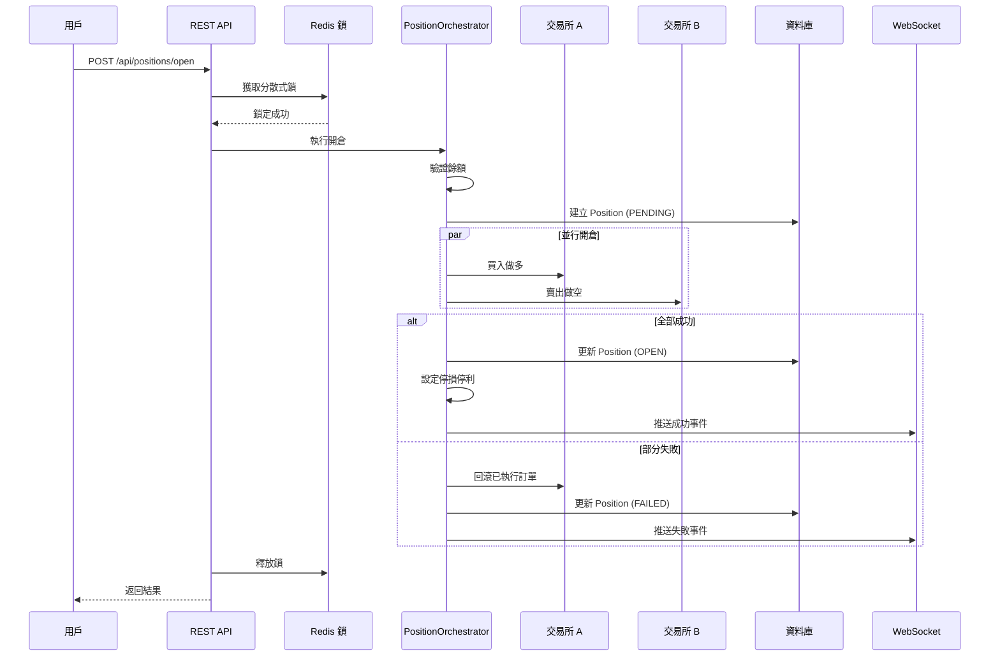
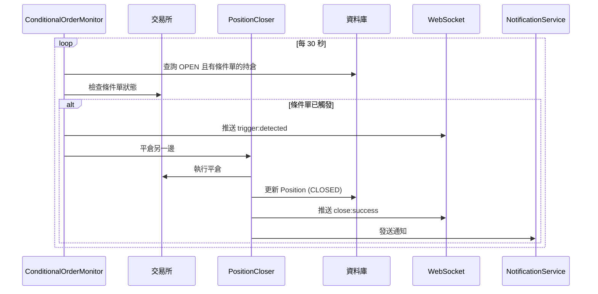
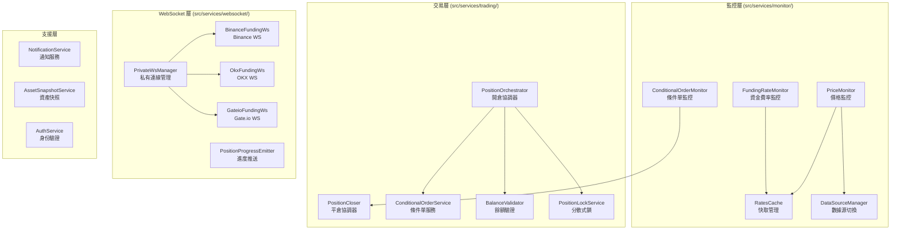
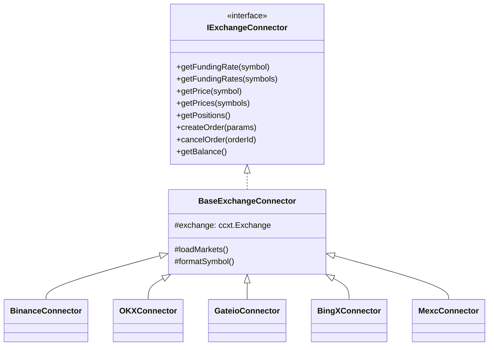
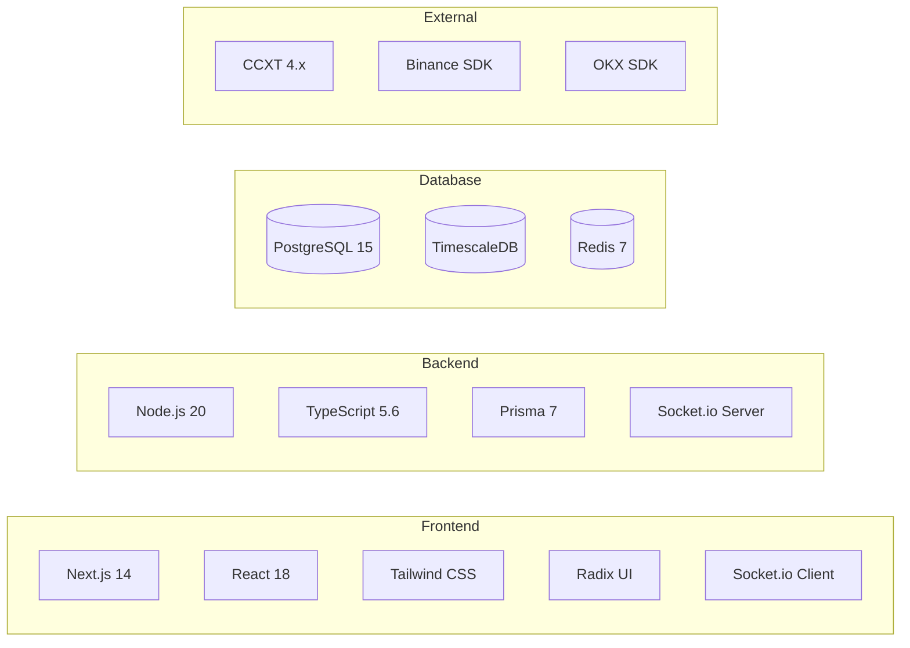
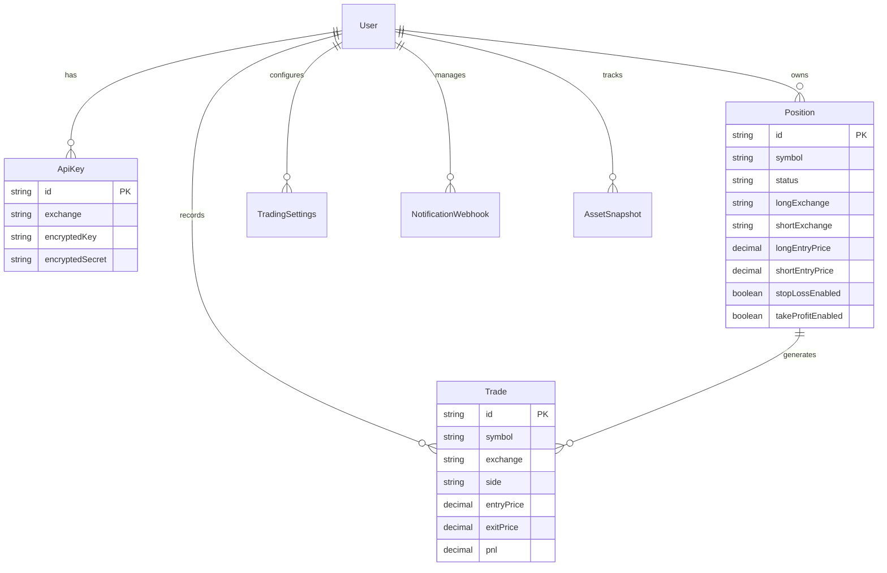

# 跨交易所資金費率套利系統架構

本文件描述系統的整體架構、核心功能流程和關鍵元件。

---

## 目錄

1. [系統概覽](#1-系統概覽)
2. [核心功能](#2-核心功能)
3. [數據流程](#3-數據流程)
4. [關鍵元件](#4-關鍵元件)
5. [API 端點摘要](#5-api-端點摘要)
6. [技術架構](#6-技術架構)

---

## 1. 系統概覽

### 1.1 架構圖



### 1.2 目錄結構

```
cross-exchange-arbitrage-bot/
├── app/                          # Next.js 14 App Router
│   ├── api/                      # REST API 端點
│   └── (dashboard)/              # 儀表板頁面
├── src/                          # 後端核心代碼
│   ├── connectors/               # 交易所連接器
│   ├── services/                 # 業務邏輯服務
│   ├── repositories/             # 資料存取層
│   ├── lib/                      # 工具函式庫
│   ├── models/                   # 資料模型
│   └── types/                    # TypeScript 類型
├── prisma/                       # 資料庫定義
├── tests/                        # 測試套件
└── docs/                         # 文檔
```

### 1.3 支援的交易所

| 交易所 | 資金費率 | 交易 | WebSocket | 備註 |
|--------|:-------:|:----:|:---------:|------|
| Binance | ✅ | ✅ | ✅ | 完整支援 |
| OKX | ✅ | ✅ | ✅ | 完整支援 |
| Gate.io | ✅ | ✅ | ✅ | 完整支援 |
| BingX | ✅ | ✅ | ✅ | 完整支援 |
| MEXC | ✅ | ❌ | ✅ | 僅監控，無交易 |

---

## 2. 核心功能

### 2.1 資金費率套利流程



### 2.2 功能模組說明

| 功能 | 說明 | 關鍵服務 |
|------|------|----------|
| **資金費率監控** | 每 5 秒查詢 5 個交易所的資金費率，計算套利機會 | `FundingRateMonitor` |
| **價格監控** | WebSocket 即時接收幣價，REST 輪詢備援 | `PriceMonitor` |
| **套利機會偵測** | 計算費率差異，評估可行性，觸發通知 | `RateDifferenceCalculator` |
| **雙邊開倉** | Saga Pattern 協調兩交易所同時開倉 | `PositionOrchestrator` |
| **一鍵平倉** | 雙邊同時平倉，自動計算 PnL | `PositionCloser` |
| **停損停利** | 設定條件單，自動監控觸發 | `ConditionalOrderService` |
| **觸發監控** | 每 30 秒檢查條件單狀態，自動執行平倉 | `ConditionalOrderMonitor` |
| **資產追蹤** | 定時快照用戶餘額，記錄歷史 | `AssetSnapshotService` |
| **通知推送** | Discord / Slack Webhook 通知 | `NotificationService` |

---

## 3. 數據流程

### 3.1 即時數據流



### 3.2 開倉流程



### 3.3 條件單觸發流程



---

## 4. 關鍵元件

### 4.1 服務層架構



### 4.2 核心服務說明

| 服務 | 路徑 | 職責 |
|------|------|------|
| **FundingRateMonitor** | `src/services/monitor/FundingRateMonitor.ts` | 定期查詢資金費率，計算差異，發出事件 |
| **PriceMonitor** | `src/services/monitor/PriceMonitor.ts` | 管理 WebSocket 連線，接收即時價格 |
| **RatesCache** | `src/services/monitor/RatesCache.ts` | 記憶體快取，儲存最新費率和價格 |
| **ConditionalOrderMonitor** | `src/services/monitor/ConditionalOrderMonitor.ts` | 監控停損停利觸發，執行自動平倉 |
| **PositionOrchestrator** | `src/services/trading/PositionOrchestrator.ts` | Saga Pattern 雙邊開倉協調 |
| **PositionCloser** | `src/services/trading/PositionCloser.ts` | 雙邊平倉，計算 PnL |
| **ConditionalOrderService** | `src/services/trading/ConditionalOrderService.ts` | 統一介面設定停損停利 |
| **PrivateWsManager** | `src/services/websocket/PrivateWsManager.ts` | 管理多用戶 WebSocket 連線 |
| **NotificationService** | `src/services/notification/NotificationService.ts` | Discord/Slack 通知推送 |

### 4.3 交易所連接器



---

## 5. API 端點摘要

### 5.1 認證

| 方法 | 路徑 | 說明 |
|------|------|------|
| POST | `/api/auth/login` | 用戶登入 |
| POST | `/api/auth/register` | 用戶註冊 |
| POST | `/api/auth/logout` | 登出 |

### 5.2 交易所 API Key

| 方法 | 路徑 | 說明 |
|------|------|------|
| GET | `/api/api-keys` | 列出所有 API Key |
| POST | `/api/api-keys` | 新增 API Key |
| DELETE | `/api/api-keys/[id]` | 刪除 API Key |
| POST | `/api/api-keys/[id]/test` | 測試連線 |

### 5.3 持倉管理

| 方法 | 路徑 | 說明 |
|------|------|------|
| GET | `/api/positions` | 列出持倉 |
| POST | `/api/positions/open` | 執行雙邊開倉 |
| POST | `/api/positions/[id]/close` | 執行雙邊平倉 |
| GET | `/api/positions/[id]/details` | 持倉詳情（含即時 PnL） |

### 5.4 市場數據

| 方法 | 路徑 | 說明 |
|------|------|------|
| GET | `/api/market-rates` | 所有交易對費率 |
| GET | `/api/market-rates/[symbol]` | 單一交易對詳情 |
| GET | `/api/balances` | 查詢交易所餘額 |

### 5.5 設定

| 方法 | 路徑 | 說明 |
|------|------|------|
| GET/PATCH | `/api/settings/trading` | 停損停利預設值 |
| GET/POST | `/api/notifications/webhooks` | Webhook 管理 |

### 5.6 WebSocket 事件

```typescript
// 開倉事件
'position:open:progress'     // 開倉進度
'position:open:success'      // 開倉成功
'position:open:failed'       // 開倉失敗

// 平倉事件
'position:close:progress'    // 平倉進度
'position:close:success'     // 平倉成功
'position:close:failed'      // 平倉失敗

// 條件單觸發事件
'position:trigger:detected'  // 觸發偵測到
'position:trigger:close:success' // 自動平倉成功

// 市場數據事件
'rate-updated'               // 費率更新
'opportunity-detected'       // 套利機會
```

---

## 6. 技術架構

### 6.1 技術棧



### 6.2 設計模式

| 模式 | 應用 | 範例 |
|------|------|------|
| **Factory** | 動態建立交易所連接器 | `ExchangeFactory` |
| **Singleton** | 共享資源管理 | `RatesCache`, `PrivateWsManager` |
| **Adapter** | 統一交易所介面 | `ConditionalOrderAdapter` |
| **Saga** | 分散式事務協調 | `PositionOrchestrator` |
| **Repository** | 資料存取抽象 | `UserRepository`, `ApiKeyRepository` |
| **Observer** | 事件驅動通知 | `FundingRateMonitor` (EventEmitter) |

### 6.3 資料模型



### 6.4 安全機制

| 項目 | 機制 |
|------|------|
| API Key 儲存 | AES-256-GCM 加密 |
| 密碼 | bcrypt 雜湊 (cost=10) |
| 認證 | JWT Token + httpOnly Cookie |
| API 保護 | 中間件驗證 + 請求追蹤 ID |

---

## 附錄

### A. 環境變數

```bash
# 資料庫
DATABASE_URL=postgresql://...
REDIS_URL=redis://...

# 認證
JWT_SECRET=...
ENCRYPTION_KEY=...

# 監控
ENABLE_PRICE_MONITOR=true
ENABLE_CONDITIONAL_ORDER_MONITOR=true
MONITORING_EXCHANGES=binance,okx,mexc,gateio,bingx
```

### B. 相關文件

- [API 參考文件](./API_REFERENCE.md)
- [用戶指南](./USER_GUIDE.md)
- [交易手續費說明](./trading-fees.md)
- [部署指南](./deployment/)
