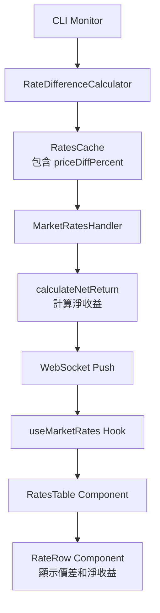

# Data Model: Web 市場監控整合價差顯示與淨收益計算

**Feature**: 011-price-spread-net-return
**Created**: 2025-11-12

---

## Overview

此功能擴展現有的 Web 市場監控資料模型，新增價差（Price Spread）和淨收益（Net Return）兩個計算欄位。無需資料庫變更，所有資料來自記憶體快取（RatesCache）。

---

## TypeScript Interfaces

### 1. BestArbitragePair（擴展）

**位置**：
- 後端：`src/models/FundingRate.ts`（已存在，無需修改）
- 前端：`app/(dashboard)/market-monitor/types.ts`（需要擴展）

**定義**：

```typescript
/**
 * 最佳套利對資訊（擴展版本）
 *
 * 包含原有的資金費率差異資訊，新增價差和淨收益欄位
 */
export interface BestArbitragePair {
  /** 做多交易所名稱 */
  longExchange: ExchangeName;

  /** 做空交易所名稱 */
  shortExchange: ExchangeName;

  /** 費率差異（小數形式，例如 0.0015） */
  spread: number;

  /** 費率差異百分比（例如 0.15 表示 0.15%） */
  spreadPercent: number;

  /** 年化收益率百分比 */
  annualizedReturn: number;

  // ========== 新增欄位 ==========

  /**
   * 價差百分比（做空價格 - 做多價格）/ 平均價格 × 100
   *
   * - 正值：做空價格 > 做多價格（有利於套利）
   * - 負值：做空價格 < 做多價格（不利於套利）
   * - null：價格資料暫時無法取得
   *
   * @example
   * priceDiffPercent = 0.15  // 價差 +0.15%（有利）
   * priceDiffPercent = -0.05 // 價差 -0.05%（不利）
   */
  priceDiffPercent?: number | null;

  /**
   * 淨收益百分比（扣除價差和手續費後的真實獲利）
   *
   * 計算公式：netReturn = spreadPercent - |priceDiffPercent| - 0.3
   *
   * - 正值：套利有獲利空間
   * - 負值：套利會虧損
   * - null：無法計算（價差資料缺失）
   *
   * @example
   * netReturn = 0.25  // 淨收益 +0.25%（優勢）
   * netReturn = 0.05  // 淨收益 +0.05%（持平）
   * netReturn = -0.1  // 淨收益 -0.1%（不利）
   */
  netReturn?: number | null;
}
```

**欄位說明**：

| 欄位 | 類型 | 來源 | 計算邏輯 |
|------|------|------|----------|
| `priceDiffPercent` | `number \| null` | RatesCache（由 RateDifferenceCalculator 計算） | `(shortPrice - longPrice) / avgPrice × 100` |
| `netReturn` | `number \| null` | WebSocket handler 即時計算 | `spreadPercent - \|priceDiffPercent\| - 0.3` |

---

### 2. SortField（擴展）

**位置**：`app/(dashboard)/market-monitor/types.ts`

**定義**：

```typescript
/**
 * 可排序欄位列表（擴展版本）
 *
 * 支援按交易對名稱、費率差異、年化收益、價差和淨收益排序
 */
export type SortField =
  | 'symbol'           // 交易對名稱（字母順序）
  | 'spread'           // 費率差異百分比
  | 'annualizedReturn' // 年化收益率
  | 'priceDiff'        // 價差百分比（新增）
  | 'netReturn';       // 淨收益百分比（新增）

/**
 * 有效排序欄位列表（用於驗證）
 */
export const VALID_SORT_FIELDS: readonly SortField[] = [
  'symbol',
  'spread',
  'annualizedReturn',
  'priceDiff',    // 新增
  'netReturn',    // 新增
] as const;
```

---

### 3. MarketRate（無需修改）

**位置**：`app/(dashboard)/market-monitor/types.ts`

**說明**：`MarketRate` 介面不需要修改，因為 `priceDiffPercent` 和 `netReturn` 都包含在 `BestArbitragePair` 中。

```typescript
export interface MarketRate {
  symbol: string;
  exchanges: {
    [key: string]: ExchangeRate;
  };
  bestPair?: BestArbitragePair | null; // 已包含新欄位
  status: string;
  timestamp: number;
}
```

---

## Data Flow



**資料流向說明**：

1. **CLI Monitor** → **RateDifferenceCalculator**：
   - CLI 監控服務定期從交易所獲取價格和資金費率
   - `RateDifferenceCalculator` 計算價差（priceDiffPercent）

2. **RateDifferenceCalculator** → **RatesCache**：
   - 計算結果儲存在記憶體快取（RatesCache）
   - 每個交易對的 `bestPair` 已包含 `priceDiffPercent`

3. **RatesCache** → **MarketRatesHandler**：
   - WebSocket handler 從快取讀取資料
   - 準備推送到前端

4. **MarketRatesHandler** → **calculateNetReturn**：
   - WebSocket handler 執行淨收益計算
   - 公式：`spreadPercent - Math.abs(priceDiffPercent) - 0.3`

5. **WebSocket Push** → **useMarketRates Hook**：
   - 透過 Socket.io 推送完整資料（包含價差和淨收益）
   - 前端 hook 接收並更新 React state

6. **RatesTable** → **RateRow**：
   - RatesTable 顯示所有交易對
   - RateRow 顯示每個交易對的價差和淨收益，使用顏色指示器

---

## Validation Rules

### priceDiffPercent

- **Type**: `number | null`
- **Range**: 通常在 ±5% 範圍內
- **Format**: 百分比數值（0.15 = 0.15%）
- **Validation**:
  - 必須為有限數值或 null
  - 如果為 NaN，轉換為 null
  - 前端顯示時檢查 `value != null && !isNaN(value)`

### netReturn

- **Type**: `number | null`
- **Range**: 通常在 ±5% 範圍內
- **Format**: 百分比數值（0.25 = 0.25%）
- **Validation**:
  - 必須為有限數值或 null
  - 計算邏輯確保一致性（spreadPercent 和 priceDiffPercent 都有效時才計算）
  - 前端顯示時檢查 `value != null && !isNaN(value)`

---

## Color Indicators（顏色指示器邏輯）

### 淨收益顏色規則

```typescript
/**
 * 根據淨收益百分比決定顏色
 *
 * @param netReturn 淨收益百分比（例如 0.15 表示 0.15%）
 * @returns 顏色配置物件
 */
function getNetReturnColor(netReturn: number): {
  bg: string;      // Tailwind 背景顏色類別
  text: string;    // Tailwind 文字顏色類別
  label: string;   // 標籤文字
} {
  if (netReturn > 0.1) {
    return {
      bg: 'bg-green-100',      // 淺綠色背景
      text: 'text-green-800',  // 深綠色文字
      label: '優勢',
    };
  } else if (netReturn >= -0.05 && netReturn <= 0.1) {
    return {
      bg: 'bg-yellow-100',     // 淺黃色背景
      text: 'text-yellow-800', // 深黃色文字
      label: '持平',
    };
  } else {
    return {
      bg: 'bg-red-100',        // 淺紅色背景
      text: 'text-red-800',    // 深紅色文字
      label: '不利',
    };
  }
}
```

**閾值定義**：

| 顏色 | 淨收益範圍 | 含義 | 建議動作 |
|------|-----------|------|---------|
| 綠色 | > 0.1% | 優勢機會 | 考慮執行套利 |
| 黃色 | -0.05% ~ 0.1% | 持平機會 | 謹慎評估 |
| 紅色 | < -0.05% | 不利機會 | 避免執行 |

---

## State Transitions

**無狀態轉換**：此功能不涉及狀態管理，僅為資料顯示。

所有資料都是即時計算的，無需持久化或狀態追蹤。

---

## Example Data

### WebSocket 推送範例

```json
{
  "symbol": "BTCUSDT",
  "exchanges": {
    "binance": {
      "rate": 0.0001,
      "ratePercent": "0.01%",
      "price": 50000.5
    },
    "okx": {
      "rate": 0.00015,
      "ratePercent": "0.015%",
      "price": 50050.2
    }
  },
  "bestPair": {
    "longExchange": "binance",
    "shortExchange": "okx",
    "spread": 0.00005,
    "spreadPercent": 0.5,
    "annualizedReturn": 438,
    "priceDiffPercent": 0.1,
    "netReturn": 0.1
  },
  "status": "active",
  "timestamp": 1699999999999
}
```

**計算驗證**：
- spreadPercent = 0.5%
- priceDiffPercent = 0.1%（做空價格略高，有利）
- netReturn = 0.5 - 0.1 - 0.3 = 0.1%（持平，黃色）

---

## Migration Guide

**無需遷移**：
- 無資料庫 schema 變更
- 無 API 版本變更
- 向後相容（舊客戶端忽略新欄位）

**升級步驟**：
1. 部署後端更新（WebSocket handler）
2. 部署前端更新（新增欄位顯示）
3. 無需資料遷移或使用者操作

---

## Summary

- **新增欄位**：2 個（priceDiffPercent、netReturn）
- **修改介面**：2 個（BestArbitragePair、SortField）
- **資料來源**：記憶體快取（RatesCache）
- **計算位置**：後端（WebSocket handler）
- **顯示位置**：前端（RatesTable + RateRow）
- **資料庫變更**：無
- **向後相容性**：完全相容
