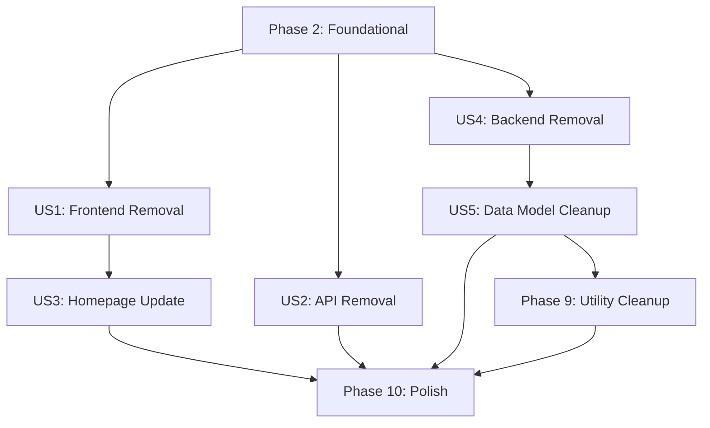

# Tasks: 移除套利機會頁面與 API

**Input**: Design documents from `/specs/013-specify-scripts-bash/`
**Prerequisites**: plan.md, spec.md, research.md, data-model.md, quickstart.md

**Tests**: Tests are NOT requested for this feature (removal operation). Verification will be done through quickstart.md checklist.

**Organization**: Tasks are grouped by user story to enable independent implementation and testing of each removal step.

## Format: `[ID] [P?] [Story] Description`
- **[P]**: Can run in parallel (different files, no dependencies)
- **[Story]**: Which user story this task belongs to (e.g., US1, US2, US3)
- Include exact file paths in descriptions

## Path Conventions
- **Frontend**: `app/` (Next.js 14 App Router)
- **Backend**: `src/` (Node.js services)
- **Database**: `prisma/` (Prisma schema)
- **Tests**: `tests/` (Jest unit/integration tests)

---

## Phase 1: Setup (Preparation)

**Purpose**: Verify current state and prepare for removal

- [ ] T001 Verify feature branch `013-specify-scripts-bash` is checked out
- [ ] T002 [P] Backup current database state (optional but recommended)
- [ ] T003 [P] Document all files to be removed in removal checklist
- [ ] T004 Run `pnpm build` to establish baseline (should succeed)
- [ ] T005 Run `pnpm test` to establish test baseline (record pass/fail state)

---

## Phase 2: Foundational (Dependency Analysis)

**Purpose**: Identify and verify safe removal boundaries

**⚠️ CRITICAL**: Ensure no critical dependencies before proceeding with removal

- [ ] T006 Search codebase for OpportunityDetector imports using `grep -r "OpportunityDetector" src/ app/`
- [ ] T007 Search codebase for ArbitrageOpportunity imports using `grep -r "ArbitrageOpportunity" src/ app/`
- [ ] T008 Search codebase for OpportunityHistory imports using `grep -r "OpportunityHistory" src/ app/`
- [ ] T009 Verify NotificationService is used only by OpportunityDetector (mark for retention)
- [ ] T010 Verify RatesCache is used by both OpportunityDetector and MarketRatesHandler (safe to remove OD)

**Checkpoint**: All searches complete - confirmed safe removal boundaries

---

## Phase 3: User Story 1 - 移除套利機會前端頁面 (Priority: P1) 🎯 MVP

**Goal**: Remove the Opportunities frontend page and all related UI components

**Independent Test**: Visit `/opportunities` → should return 404, navigation menu should not show "套利機會" entry

### Implementation for User Story 1

- [ ] T011 [P] [US1] Delete entire `app/(dashboard)/opportunities/` directory
- [ ] T012 [P] [US1] Search and remove navigation links to opportunities in `app/layout.tsx` or sidebar components
- [ ] T013 [US1] Update default homepage redirect to `/market-monitor` in authentication/login flow
- [ ] T014 [US1] Run `pnpm build` to verify frontend compiles without opportunities components
- [ ] T015 [US1] Start dev server and verify `/opportunities` returns 404
- [ ] T016 [US1] Verify Market Monitor page loads correctly at `/market-monitor`

**Checkpoint**: At this point, frontend removal is complete and independently testable (US1 acceptance criteria met)

---

## Phase 4: User Story 2 - 移除套利機會 API 端點 (Priority: P1)

**Goal**: Remove all Opportunities API endpoints

**Independent Test**: curl requests to `/api/opportunities/*` should return 404

### Implementation for User Story 2

- [ ] T017 [P] [US2] Delete entire `app/api/opportunities/` directory
- [ ] T018 [US2] Run `pnpm build` to verify API routes compile correctly
- [ ] T019 [US2] Start dev server and verify `GET /api/opportunities` returns 404
- [ ] T020 [US2] Verify `GET /api/opportunities/:id` returns 404 (if route existed)
- [ ] T021 [US2] Verify Market Monitor API `/api/market-rates` still works correctly

**Checkpoint**: At this point, API removal is complete and independently testable (US2 acceptance criteria met)

---

## Phase 5: User Story 3 - 更新預設首頁為市場監控 (Priority: P2)

**Goal**: Ensure users land on Market Monitor after login instead of Opportunities

**Independent Test**: Log in → should automatically redirect to `/market-monitor`

### Implementation for User Story 3

- [ ] T022 [US3] Locate login redirect logic (likely in authentication middleware or login route handler)
- [ ] T023 [US3] Update redirect destination from `/opportunities` to `/market-monitor`
- [ ] T024 [US3] Check for any hardcoded references to `/opportunities` in the codebase using `grep -r "'/opportunities'" app/ src/`
- [ ] T025 [US3] Update root path `/` handler to redirect to `/market-monitor` (if applicable)
- [ ] T026 [US3] Test login flow → verify automatic redirect to `/market-monitor`
- [ ] T027 [US3] Verify bookmark to `/opportunities` shows 404 or redirects gracefully

**Checkpoint**: At this point, default homepage is updated (US3 acceptance criteria met)

---

## Phase 6: User Story 4 - 移除後端業務邏輯 (Priority: P2)

**Goal**: Remove OpportunityDetector service and stop opportunity detection/notification

**Independent Test**: Start system → verify OpportunityDetector does not appear in startup logs, no new opportunity records in database

### Implementation for User Story 4

- [ ] T028 [US4] Remove OpportunityDetector registration from `src/services/monitor/MonitorService.ts`
- [ ] T029 [P] [US4] Delete `src/services/monitor/OpportunityDetector.ts`
- [ ] T030 [US4] Verify `src/services/notification/NotificationService.ts` is retained (do NOT delete)
- [ ] T031 [US4] Run TypeScript compiler `pnpm tsc --noEmit` to check for broken imports
- [ ] T032 [US4] Fix any import errors in MonitorService or related files
- [ ] T033 [US4] Start system and verify no "OpportunityDetector started" log messages
- [ ] T034 [US4] Monitor database for 30 seconds → verify no new records in ArbitrageOpportunity table

**Checkpoint**: At this point, backend business logic removal is complete (US4 acceptance criteria met)

---

## Phase 7: User Story 5 - 清理資料模型與 Repository (Priority: P3)

**Goal**: Remove repository classes and mark Prisma models as deprecated

**Independent Test**: Check Prisma schema for @deprecated annotations, verify repository files deleted, historical data still queryable

### Implementation for User Story 5

- [ ] T035 [P] [US5] Delete `src/repositories/ArbitrageOpportunityRepository.ts`
- [ ] T036 [P] [US5] Delete `src/repositories/OpportunityHistoryRepository.ts`
- [ ] T037 [P] [US5] Delete `src/models/ArbitrageOpportunity.ts`
- [ ] T038 [P] [US5] Delete `src/models/OpportunityHistory.ts`
- [ ] T039 [US5] Add @deprecated annotation to ArbitrageOpportunity model in `prisma/schema.prisma`
- [ ] T040 [US5] Add @deprecated annotation to OpportunityHistory model in `prisma/schema.prisma`
- [ ] T041 [US5] Run `pnpm prisma generate` to regenerate Prisma Client with deprecated models
- [ ] T042 [US5] Verify historical data still exists: `SELECT COUNT(*) FROM "ArbitrageOpportunity";`
- [ ] T043 [US5] Verify no new records: `SELECT COUNT(*) FROM "ArbitrageOpportunity" WHERE "detectedAt" >= CURRENT_DATE;` should be 0

**Checkpoint**: At this point, data model cleanup is complete (US5 acceptance criteria met)

---

## Phase 8: Test Cleanup

**Purpose**: Remove obsolete tests related to Opportunities feature

- [ ] T044 [P] Search for opportunity-related test files using `find tests/ -name "*opportunity*" -o -name "*Opportunity*"`
- [ ] T045 [P] Delete `tests/integration/opportunities.test.ts` (if exists)
- [ ] T046 [P] Delete `tests/unit/OpportunityDetector.test.ts` (if exists)
- [ ] T047 Delete any other opportunity-related test files found in T044
- [ ] T048 Run `pnpm test` → verify all remaining tests pass
- [ ] T049 Verify no skipped or broken tests due to removal

---

## Phase 9: Utility & Helper Cleanup

**Purpose**: Remove unused utility functions only used by Opportunities

- [ ] T050 Check if `src/lib/debounce.ts` is used elsewhere using `grep -r "debounce" src/ --exclude-dir=lib`
- [ ] T051 Delete `src/lib/debounce.ts` ONLY if not used by other components
- [ ] T052 Search for other opportunity-specific utilities in `src/lib/`
- [ ] T053 Remove any other unused utilities identified in T052

---

## Phase 10: Polish & Cross-Cutting Concerns

**Purpose**: Documentation updates and final verification

- [ ] T054 [P] Update `README.md` to remove Opportunities feature documentation
- [ ] T055 [P] Update `CHANGELOG.md` with breaking change notice:
  ```markdown
  ## [VERSION] - 2025-01-21

  ### BREAKING CHANGES
  - **Removed**: Opportunities page (`/opportunities`) and API (`/api/opportunities/*`)
  - **Replaced by**: Market Monitor page (`/market-monitor`) provides real-time monitoring
  - **Migration**: Users should use Market Monitor for all arbitrage opportunity detection

  ### Removed
  - Frontend: `app/(dashboard)/opportunities/` directory
  - API: `app/api/opportunities/` directory
  - Backend: OpportunityDetector service
  - Models: ArbitrageOpportunity, OpportunityHistory (marked @deprecated in schema, data retained)
  ```
- [ ] T056 [P] Update documentation referencing opportunities feature (if any in `docs/`)
- [ ] T057 Run full build: `pnpm build` → verify successful
- [ ] T058 Run all tests: `pnpm test` → verify all pass
- [ ] T059 Execute quickstart.md verification checklist (all 7 steps)
- [ ] T060 Verify constitution compliance matches plan.md (all 6 principles ✅)
- [ ] T061 Review git status to ensure no unintended files were modified
- [ ] T062 Create commit with message following conventional commits format

**Checkpoint**: All tasks complete - ready for code review and merge

---

## Dependencies & Execution Order

### Phase Dependencies

- **Setup (Phase 1)**: No dependencies - can start immediately
- **Foundational (Phase 2)**: Depends on Setup completion - BLOCKS all user stories
- **User Stories (Phase 3-7)**: All depend on Foundational phase completion
  - **US1 (Phase 3)**: Can start after Foundational - No dependencies on other stories
  - **US2 (Phase 4)**: Can start after Foundational - No dependencies (independent from US1)
  - **US3 (Phase 5)**: Depends on US1 completion (needs frontend removal to update redirect)
  - **US4 (Phase 6)**: Can start after Foundational - Independent from US1/US2
  - **US5 (Phase 7)**: Depends on US4 completion (backend must be removed first)
- **Test Cleanup (Phase 8)**: Can run in parallel with US4/US5 or after
- **Utility Cleanup (Phase 9)**: Depends on all US completion (to verify no usage)
- **Polish (Phase 10)**: Depends on all previous phases

### User Story Dependencies



### Within Each User Story

Since this is a removal operation (not new development), dependencies are minimal:
- Delete operations within a story are mostly parallelizable ([P] marked)
- Verification steps must run sequentially after deletions
- Build/test verification at end of each story

### Parallel Opportunities

**After Foundational (Phase 2) completes:**

- **US1 + US2 + US4** can be worked on in parallel (different directories)
  - T011-T016 (US1 frontend) || T017-T021 (US2 API) || T028-T034 (US4 backend)
- **Within US5** (Phase 7):
  - T035, T036, T037, T038 can all run in parallel (different files)
- **Phase 8** (Test Cleanup):
  - T044, T045, T046 can all run in parallel (different test files)
- **Phase 10** (Polish):
  - T054, T055, T056 can run in parallel (different documentation files)

---

## Parallel Example: After Foundational Phase

```bash
# Three developers can work simultaneously:

# Developer A: US1 (Frontend)
Task: "Delete entire app/(dashboard)/opportunities/ directory"
Task: "Remove navigation links in app/layout.tsx"
Task: "Update default homepage redirect"

# Developer B: US2 (API)
Task: "Delete entire app/api/opportunities/ directory"
Task: "Verify API endpoints return 404"

# Developer C: US4 (Backend)
Task: "Delete src/services/monitor/OpportunityDetector.ts"
Task: "Remove OpportunityDetector from MonitorService.ts"
Task: "Verify no OpportunityDetector in startup logs"
```

---

## Implementation Strategy

### MVP First (User Story 1 + User Story 2)

1. Complete Phase 1: Setup ✓
2. Complete Phase 2: Foundational (dependency analysis) ✓
3. Complete Phase 3: User Story 1 (Frontend removal) ✓
4. Complete Phase 4: User Story 2 (API removal) ✓
5. **STOP and VALIDATE**: Test that frontend and API are removed, Market Monitor works
6. Can deploy if desired (basic removal complete)

### Incremental Delivery

1. **Setup + Foundational** → Safe boundaries identified
2. **US1 + US2** → Frontend and API removed, user-facing changes complete
3. **US3** → Homepage redirect updated
4. **US4** → Backend cleanup (no more opportunity detection)
5. **US5** → Data model marked deprecated
6. **Cleanup + Polish** → Documentation updated, full verification
7. Each phase reduces system complexity incrementally

### Single Developer Strategy (Recommended)

Given the sequential nature of removal and small scope (~62 tasks):

1. Execute phases sequentially (Phase 1 → 2 → 3 → ... → 10)
2. Complete each user story before moving to next
3. Verify after each story using Independent Test criteria
4. Estimated time: 4-6 hours total

### Parallel Team Strategy (If Desired)

With 2-3 developers:

1. **All**: Complete Setup + Foundational together (T001-T010)
2. **Split**:
   - Dev A: US1 (Frontend) + US3 (Homepage)
   - Dev B: US2 (API) + Phase 8 (Test Cleanup)
   - Dev C: US4 (Backend) + US5 (Data Model)
3. **Merge**: Phase 9 (Utilities) + Phase 10 (Polish) together
4. Estimated time: 2-3 hours with coordination

---

## Verification Checklist (from quickstart.md)

After completing all tasks, verify:

- [ ] ✅ All relevant files deleted (T011, T017, T029, T035-T038)
- [ ] ✅ Prisma schema has @deprecated annotations (T039-T040)
- [ ] ✅ Build succeeds: `pnpm build` (T057)
- [ ] ✅ Tests pass: `pnpm test` (T058)
- [ ] ✅ `/opportunities` returns 404 (T015)
- [ ] ✅ `/api/opportunities` returns 404 (T019)
- [ ] ✅ Market Monitor works correctly (T016, T021)
- [ ] ✅ No OpportunityDetector in logs (T033)
- [ ] ✅ No new opportunity records (T034, T043)
- [ ] ✅ NotificationService retained (T030)
- [ ] ✅ CHANGELOG.md updated (T055)
- [ ] ✅ README.md updated (T054)
- [ ] ✅ Constitution compliance verified (T060)

---

## Notes

- **[P] tasks**: Different files, no dependencies - can run in parallel
- **[Story] label**: Maps task to specific user story for traceability
- **Removal operation**: Most tasks are deletions, verification is critical
- **Data safety**: Historical data is preserved (Principle IV compliance)
- **Testing approach**: Manual verification via quickstart.md (no automated tests needed)
- **Commit strategy**: Can commit after each phase or at end (single PR recommended)
- **Rollback plan**: All deletions tracked in git, easy to revert if needed
- **Constitution gates**: All 6 principles pass ✅ (verified in plan.md)

---

## Summary Statistics

- **Total Tasks**: 62
- **Parallelizable Tasks**: 18 (marked with [P])
- **User Stories**: 5 (US1-US5)
- **Phases**: 10 (Setup → Foundational → 5 User Stories → Cleanup → Utilities → Polish)
- **Estimated Time**: 4-6 hours (single developer) or 2-3 hours (parallel team)
- **Breaking Changes**: Yes (API removal) - documented in CHANGELOG
- **Data Loss Risk**: None (historical data preserved)
- **Rollback Difficulty**: Low (git revert)
