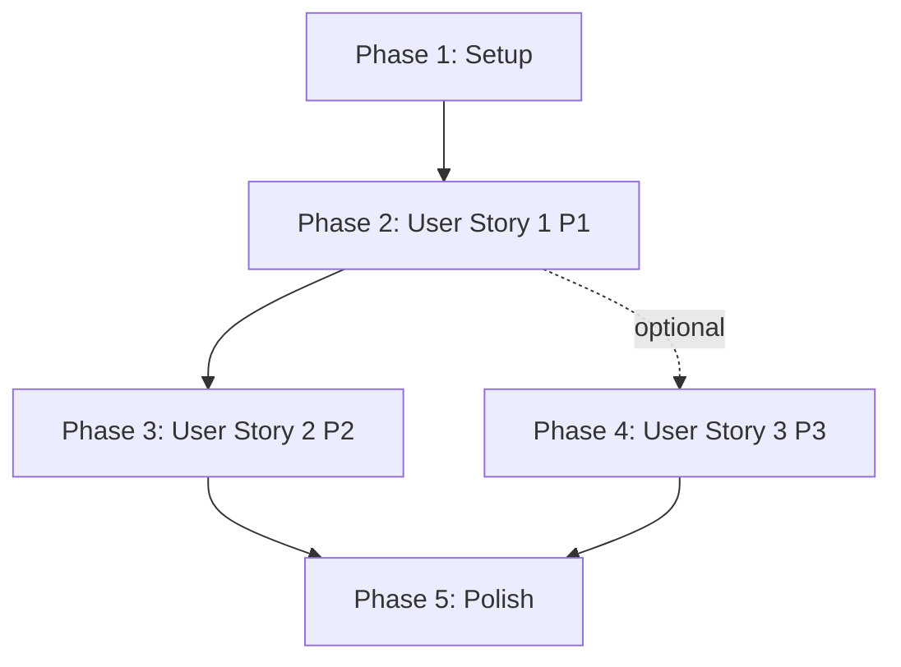

# Tasks: 移除淨收益欄位，改為獨立參考指標顯示

**Input**: Design documents from `/specs/014-remove-net-return-display/`
**Prerequisites**: plan.md, spec.md, research.md, data-model.md, contracts/api-changes.md, quickstart.md

**Tests**: E2E tests included to verify complete functionality

**Organization**: Tasks are grouped by user story to enable independent implementation and testing of each story.

## Format: `[ID] [P?] [Story] Description`
- **[P]**: Can run in parallel (different files, no dependencies)
- **[Story]**: Which user story this task belongs to (e.g., US1, US2, US3)
- Include exact file paths in descriptions

## Path Conventions
- **Web app**: Next.js 14 App Router structure
  - Frontend: `app/(dashboard)/market-monitor/`
  - API: `app/api/`
  - Backend services: `src/`
  - Tests: `tests/`
  - Docs: `docs/`

---

## Phase 1: Setup (Shared Infrastructure)

**Purpose**: 確保開發環境準備就緒，無需新增基礎設施（純 UI 重構）

**Tasks**:

- [X] T001 Verify Next.js 14 App Router environment is running (pnpm dev)
- [X] T002 [P] Verify TypeScript 5.6+ compiler configuration in tsconfig.json
- [X] T003 [P] Verify development dependencies: Jest, React Testing Library, Playwright

**Checkpoint**: Development environment ready - no foundational changes needed (pure UI refactoring)

---

## Phase 2: User Story 1 - 查看獨立參考指標進行套利判斷 (Priority: P1) 🎯 MVP

**Goal**: 移除市場監控頁面的「淨收益」欄位，新增「預估手續費」欄位，讓用戶看到三個獨立指標（費率差、價差、手續費）

**Independent Test**: 訪問 http://localhost:3000/market-monitor，驗證表格顯示「費率差異」、「價差」、「預估手續費」三個欄位，且不顯示「淨收益」欄位

**Dependencies**: None (MVP - first priority)

### Frontend Type Definitions

- [X] T004 [P] [US1] Update BestArbitragePair interface in app/(dashboard)/market-monitor/types.ts - remove netReturn field
- [X] T005 [P] [US1] Update SortField type in app/(dashboard)/market-monitor/types.ts - remove 'netReturn' option

### Frontend Components

- [ ] T006 [P] [US1] Create FeeEstimateTooltip component in app/(dashboard)/market-monitor/components/FeeEstimateTooltip.tsx
- [ ] T007 [US1] Update RatesTable component in app/(dashboard)/market-monitor/components/RatesTable.tsx - remove 淨收益 column header, add 預估手續費 column header
- [ ] T008 [US1] Update RateRow component in app/(dashboard)/market-monitor/components/RateRow.tsx - replace NetProfitTooltip with FeeEstimateTooltip, update high opportunity logic to use spreadPercent > 0.5%
- [ ] T009 [US1] Delete NetProfitTooltip component in app/(dashboard)/market-monitor/components/NetProfitTooltip.tsx (no longer needed)

### Frontend Utils & Hooks

- [X] T010 [P] [US1] Update sortComparator in app/(dashboard)/market-monitor/utils/sortComparator.ts - remove netReturn comparator case
- [X] T011 [P] [US1] Update useTableSort hook in app/(dashboard)/market-monitor/hooks/useTableSort.ts - ensure default sort is not netReturn

### Backend API Changes

- [X] T012 [P] [US1] Update GET /api/market-rates in app/api/market-rates/route.ts - remove netReturn calculation and return value
- [X] T013 [P] [US1] Update MarketRatesHandler in src/websocket/handlers/MarketRatesHandler.ts - remove netReturn from WebSocket push data

### Code Cleanup

- [ ] T014 [US1] Delete net-return-calculator in src/lib/net-return-calculator.ts (unused after refactoring)
- [ ] T015 [US1] Delete net-return-calculator tests in tests/unit/lib/net-return-calculator.test.ts

### Testing for User Story 1

- [ ] T016 [US1] Update E2E tests in tests/e2e/market-monitor.spec.ts - verify 3 columns shown, netReturn column not shown, sorting works, high opportunity logic uses spreadPercent

**Checkpoint**: User Story 1 complete - Users can view 3 independent metrics (rate spread, price差, fee estimate) without misleading net return calculation

---

## Phase 3: User Story 2 - 理解手續費成本結構 (Priority: P2)

**Goal**: 提供詳細的手續費明細 Tooltip，讓用戶理解 4 筆交易的成本結構

**Independent Test**: 點擊市場監控頁面的「預估手續費」欄位說明圖示，驗證 Tooltip 顯示 4 筆 Taker 交易明細（各 0.05%），總計 0.2%

**Dependencies**: T006 (FeeEstimateTooltip component exists)

### UI Enhancement

- [ ] T017 [US2] Enhance FeeEstimateTooltip component in app/(dashboard)/market-monitor/components/FeeEstimateTooltip.tsx - add detailed breakdown table (建倉做多/做空, 平倉做多/做空, 各 0.05%), total 0.2%, note about Taker fee

### Testing for User Story 2

- [ ] T018 [US2] Update E2E tests in tests/e2e/market-monitor.spec.ts - verify Tooltip shows 4 transaction details, total 0.2%, Taker fee label

**Checkpoint**: User Story 2 complete - Users can understand fee cost structure through detailed Tooltip

---

## Phase 4: User Story 3 - 開發者查閱手續費計算規範 (Priority: P3)

**Goal**: 建立專案的手續費計算規範文件，明確定義套利交易的手續費標準

**Independent Test**: 查閱 docs/trading-fees.md 文件，驗證包含公式、費率類型、相關假設

**Dependencies**: None (documentation task, independent of code)

### Documentation

- [ ] T019 [P] [US3] Create trading fees documentation in docs/trading-fees.md - include formula (0.05% × 4 = 0.2%), 4 transaction breakdown, Taker fee explanation, assumptions, examples

### Testing for User Story 3

- [ ] T020 [US3] Verify docs/trading-fees.md exists and contains required sections (formula, transaction breakdown, assumptions)

**Checkpoint**: User Story 3 complete - Developers can reference standardized trading fee calculation documentation

---

## Phase 5: Polish & Cross-Cutting Concerns

**Purpose**: Final improvements, documentation updates, validation

### Final Validation

- [ ] T021 [P] Run TypeScript compiler check (pnpm tsc --noEmit) - verify no type errors
- [ ] T022 [P] Run all unit tests (pnpm test --run) - verify all tests pass
- [ ] T023 [P] Run E2E tests (pnpm test:e2e market-monitor) - verify complete user flows
- [ ] T024 Perform visual regression testing - compare before/after screenshots of market monitor page

### Documentation Updates

- [ ] T025 [P] Update API documentation - remove netReturn field from GET /api/market-rates and WebSocket event documentation
- [ ] T026 [P] Update CLAUDE.md if needed - add any new conventions or patterns introduced

### Code Quality

- [ ] T027 [P] Run ESLint (pnpm lint) - ensure code style compliance
- [ ] T028 [P] Review all modified files for code comments and clarity
- [ ] T029 Verify no console.log statements remain in production code

**Checkpoint**: All quality gates passed - feature ready for deployment

---

## Dependencies & Execution Order

### User Story Dependencies

**Execution Strategy**:

1. **MVP First** (Phase 1 + Phase 2):
   - Complete Setup (T001-T003)
   - Complete User Story 1 (T004-T016)
   - **MVP Deliverable**: Users can view 3 independent metrics

2. **Incremental Enhancements**:
   - Phase 3 (US2): Add fee detail Tooltip (T017-T018)
   - Phase 4 (US3): Add documentation (T019-T020)

3. **Final Polish** (Phase 5): T021-T029

### Parallel Execution Opportunities

#### Phase 1 (Setup)
- T002 + T003 can run in parallel

#### Phase 2 (User Story 1)
- **Group A** (Type definitions): T004 + T005
- **Group B** (Components): T006 + T007 + T008 (after Group A completes)
- **Group C** (Utils): T010 + T011 (after Group A completes)
- **Group D** (Backend): T012 + T013 (independent of frontend)
- **Sequential**: T009 (delete) → T014 → T015 → T016 (testing)

#### Phase 3 (User Story 2)
- T017 (depends on T006 completion)
- T018 (testing, after T017)

#### Phase 4 (User Story 3)
- T019 (fully independent, can run in parallel with US2)
- T020 (testing, after T019)

#### Phase 5 (Polish)
- **Group A**: T021 + T022 + T023 (all tests in parallel)
- **Group B**: T025 + T026 + T027 (all docs/linting in parallel)
- **Sequential**: T024 (visual testing) → T028 (code review) → T029 (final cleanup)

---

## Implementation Strategy

### MVP Scope (Minimum Viable Product)

**Recommended MVP**: Phase 1 + Phase 2 (User Story 1 only)

**Rationale**:
- User Story 1 provides core value: remove misleading netReturn, show 3 independent metrics
- Users can immediately make better arbitrage judgments
- Can be deployed and validated independently
- US2 and US3 are enhancements, not blockers

**MVP Delivery**: 16 tasks (T001-T016)

### Full Feature Scope

**Total Tasks**: 29 tasks across 5 phases

**Task Breakdown by Phase**:
- Phase 1 (Setup): 3 tasks
- Phase 2 (User Story 1): 13 tasks
- Phase 3 (User Story 2): 2 tasks
- Phase 4 (User Story 3): 2 tasks
- Phase 5 (Polish): 9 tasks

**Estimated Effort**:
- Phase 1: 15 minutes
- Phase 2: 2-3 hours (core refactoring)
- Phase 3: 30 minutes (UI enhancement)
- Phase 4: 20 minutes (documentation)
- Phase 5: 1 hour (testing and validation)

**Total Estimated Time**: 4-5 hours

---

## Task Validation Checklist

All tasks follow required format:
- ✅ Every task starts with `- [ ]` (checkbox)
- ✅ Every task has sequential ID (T001-T029)
- ✅ Parallelizable tasks marked with `[P]`
- ✅ User story tasks marked with `[US1]`, `[US2]`, or `[US3]`
- ✅ Every task includes specific file path
- ✅ Tasks organized by user story for independent implementation

---

## Next Steps

1. **Review Tasks**: Ensure all team members understand the task breakdown
2. **Choose Approach**:
   - **Option A**: Execute MVP only (T001-T016) for fastest delivery
   - **Option B**: Execute full feature (T001-T029) for complete solution
   - **Option C**: Use `/speckit.implement` to auto-execute tasks
3. **Begin Implementation**: Start with Phase 1 (Setup verification)
4. **Track Progress**: Mark tasks complete as you go
5. **Test Incrementally**: Verify each user story independently

---

## Success Criteria (from spec.md)

- ✅ **SC-001**: 用戶訪問市場監控頁面時，能清楚看到資金費率差、價差、預估手續費三個獨立的參考指標
- ✅ **SC-002**: 市場監控頁面中不再顯示「淨收益」欄位或任何依賴淨收益計算的 UI 元素
- ✅ **SC-003**: 用戶點擊預估手續費說明時，能看到詳細的手續費計算明細（4 筆 Taker 交易）
- ✅ **SC-004**: 開發者能在專案文件中找到清楚的手續費計算規範
- ✅ **SC-005**: 系統代碼庫中不再包含未使用的淨收益計算邏輯
- ✅ **SC-006**: 表格排序和篩選功能正常運作
- ✅ **SC-007**: WebSocket 實時數據更新時，三個獨立指標能正確同步顯示最新數據

All success criteria are addressed by the tasks above.
