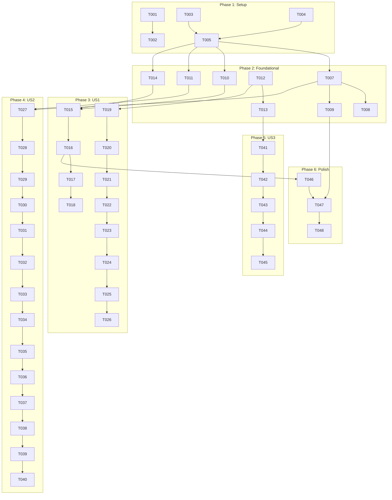

# Tasks: 用戶密碼管理

**Feature**: 061-password-management
**Branch**: `061-specify-scripts-bash`
**Generated**: 2026-01-09
**Total Tasks**: 48

## Task Summary

| Phase | Description | Tasks |
|-------|-------------|-------|
| Phase 1 | Setup | 6 |
| Phase 2 | Foundational | 8 |
| Phase 3 | US1 - 已登入用戶變更密碼 (P1) | 12 |
| Phase 4 | US2 - 忘記密碼重設流程 (P2) | 14 |
| Phase 5 | US3 - 密碼強度即時回饋 (P3) | 5 |
| Phase 6 | Polish & Cross-Cutting | 3 |

---

## Phase 1: Setup

**Goal**: 環境配置與基礎設施準備

- [x] T001 Add email configuration environment variables to `src/lib/env.ts`
- [x] T002 Add SMTP environment variables to `.env.example`
- [x] T003 [P] Create Prisma migration for User model password fields in `prisma/migrations/[timestamp]_add_password_management/`
- [x] T004 [P] Create PasswordResetToken model in `prisma/schema.prisma`
- [x] T005 Run Prisma migration and generate client with `pnpm prisma migrate dev`
- [x] T006 Extend auth types in `src/types/auth.ts` with password-related interfaces

---

## Phase 2: Foundational

**Goal**: 建立跨 User Story 共用的基礎服務

### Email Service (Shared by US1, US2)

- [x] T007 Create EmailService class in `src/lib/email/EmailService.ts`
- [x] T008 [P] Create password reset email template in `src/lib/email/templates/password-reset.ts`
- [x] T009 [P] Create account locked email template in `src/lib/email/templates/account-locked.ts`

### Repository Layer (Shared by US1, US2)

- [x] T010 Extend UserRepository with lockout methods in `src/repositories/UserRepository.ts`
- [x] T011 [P] Create PasswordResetTokenRepository in `src/repositories/PasswordResetTokenRepository.ts`

### Validation & Security (Shared by US1, US2, US3)

- [x] T012 Create password validation schema in `src/lib/validation.ts`
- [x] T013 [P] Create password strength calculator in `src/lib/password-strength.ts`
- [x] T014 Extend JWT payload with tokenVersion in `src/lib/jwt.ts`

---

## Phase 3: User Story 1 - 已登入用戶變更密碼 (P1)

**Goal**: 已登入用戶可在設定頁面變更密碼

**Independent Test**: 登入帳戶 → 進入設定頁面 → 變更密碼 → 登出 → 使用新密碼登入

### Backend

- [x] T015 [US1] Write failing test for AuthService.changePassword in `tests/unit/services/AuthService.changePassword.test.ts`
- [x] T016 [US1] Implement changePassword method in `src/services/auth/AuthService.ts`
- [x] T017 [US1] Add tokenVersion increment on password change in `src/services/auth/AuthService.ts`
- [x] T018 [US1] Implement session invalidation check in `src/services/auth/SessionManager.ts`
- [x] T019 [US1] Write failing test for change-password API in `tests/integration/api/auth/change-password.test.ts`
- [x] T020 [US1] Create POST /api/auth/change-password endpoint in `app/api/auth/change-password/route.ts`
- [x] T021 [US1] Add audit logging for PASSWORD_CHANGE action in `src/services/auth/AuthService.ts`

### Frontend

- [x] T022 [US1] Create ChangePasswordForm component in `app/(dashboard)/settings/security/components/ChangePasswordForm.tsx`
- [x] T023 [US1] Create useChangePassword hook in `app/(dashboard)/settings/security/hooks/useChangePassword.ts`
- [x] T024 [US1] Create security settings page in `app/(dashboard)/settings/security/page.tsx`
- [x] T025 [US1] Add security link to settings navigation in `app/(dashboard)/settings/layout.tsx`

### Integration

- [x] T026 [US1] End-to-end test: change password flow in `tests/e2e/change-password.test.ts`

---

## Phase 4: User Story 2 - 忘記密碼重設流程 (P2)

**Goal**: 用戶可透過電子郵件重設密碼

**Independent Test**: 登入頁面 → 點擊忘記密碼 → 輸入 email → 收到郵件 → 點擊連結 → 設定新密碼 → 登入

### Backend Services

- [x] T027 [US2] Write failing test for PasswordResetService in `tests/unit/services/PasswordResetService.test.ts`
- [x] T028 [US2] Create PasswordResetService in `src/services/auth/PasswordResetService.ts`
- [x] T029 [US2] Implement token generation with crypto.randomBytes in `src/services/auth/PasswordResetService.ts`
- [x] T030 [US2] Implement rate limiting (60s per email) in `src/services/auth/PasswordResetService.ts`
- [x] T031 [US2] Add audit logging for PASSWORD_RESET_REQUEST, PASSWORD_RESET_COMPLETE in `src/services/auth/PasswordResetService.ts`

### Backend API

- [x] T032 [US2] Write failing test for forgot-password API in `tests/integration/api/auth/forgot-password.test.ts`
- [x] T033 [US2] Create POST /api/auth/forgot-password endpoint in `app/api/auth/forgot-password/route.ts`
- [x] T034 [US2] Write failing test for reset-password API in `tests/integration/api/auth/reset-password.test.ts`
- [x] T035 [US2] Create POST /api/auth/reset-password endpoint in `app/api/auth/reset-password/route.ts`
- [x] T036 [US2] Create GET /api/auth/validate-reset-token endpoint in `app/api/auth/validate-reset-token/route.ts`

### Frontend

- [x] T037 [US2] Add "Forgot Password" link to login page in `app/(auth)/login/page.tsx`
- [x] T038 [US2] Create forgot password page in `app/(auth)/forgot-password/page.tsx`
- [x] T039 [US2] Create reset password page in `app/(auth)/reset-password/page.tsx`
- [x] T040 [US2] Create usePasswordReset hook in `app/(auth)/reset-password/hooks/usePasswordReset.ts`

---

## Phase 5: User Story 3 - 密碼強度即時回饋 (P3)

**Goal**: 用戶在設定密碼時即時看到強度指示

**Independent Test**: 在密碼輸入欄輸入不同複雜度的密碼，觀察強度指示器變化

### Backend (Optional API)

- [x] T041 [US3] Write failing test for password-strength API in `tests/unit/lib/password-strength.test.ts`
- [x] T042 [US3] Create POST /api/auth/password-strength endpoint in `app/api/auth/password-strength/route.ts`

### Frontend

- [x] T043 [US3] Create PasswordStrengthIndicator component in `app/components/PasswordStrengthIndicator.tsx`
- [x] T044 [US3] Integrate PasswordStrengthIndicator into ChangePasswordForm in `app/(dashboard)/settings/security/components/ChangePasswordForm.tsx`
- [x] T045 [US3] Integrate PasswordStrengthIndicator into reset password page in `app/(auth)/reset-password/page.tsx`

---

## Phase 6: Polish & Cross-Cutting Concerns

**Goal**: 完善錯誤處理、日誌記錄和文件

### Brute Force Protection

- [x] T046 Extend AuthService.login with lockout logic in `src/services/auth/AuthService.ts`
- [x] T047 Send account locked email notification in `src/services/auth/AuthService.ts`

### Documentation

- [x] T048 Update API documentation with new endpoints in `docs/api/auth.md`

---

## Dependencies



## Parallel Execution Examples

### Phase 2 Parallelization

```bash
# Run in parallel (different files, no dependencies)
T008 & T009 & T011 & T013  # Email templates, Repository, Password strength
```

### Phase 3 Parallelization

```bash
# Can run T022, T023 in parallel after T021 completes
T022 & T023  # Frontend components while API is ready
```

### Phase 4 Parallelization

```bash
# Backend APIs can be developed in parallel with frontend
T033 & T035 & T036  # After T032, T034 tests
```

---

## Implementation Strategy

### MVP Scope (Recommended First Delivery)

**Phase 1 + Phase 2 + Phase 3 (US1)** = 26 tasks

Delivers:
- ✅ 用戶可變更密碼
- ✅ 密碼強度驗證
- ✅ Session 失效機制
- ✅ 審計日誌

### Incremental Additions

1. **+Phase 4 (US2)**: 忘記密碼功能（需要 Email 服務）
2. **+Phase 5 (US3)**: 密碼強度 UI 增強
3. **+Phase 6**: 暴力破解保護完善

---

## Acceptance Criteria Mapping

| User Story | Key Tasks | Acceptance Test |
|------------|-----------|-----------------|
| US1 (P1) | T016, T020, T024 | T026 e2e test |
| US2 (P2) | T028, T033, T035, T039 | Manual: email flow |
| US3 (P3) | T043, T044, T045 | Visual: strength indicator |

---

## Notes

- Constitution VII (TDD) requires tests MUST be written and FAIL before implementation
- All tasks follow Red-Green-Refactor cycle
- [P] marker indicates parallelizable tasks
- [USx] marker indicates user story association
